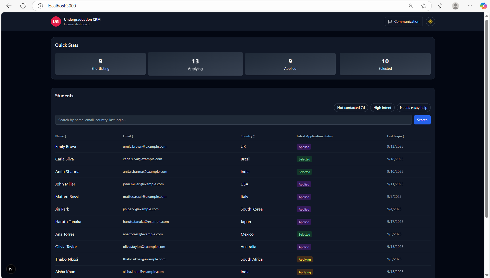
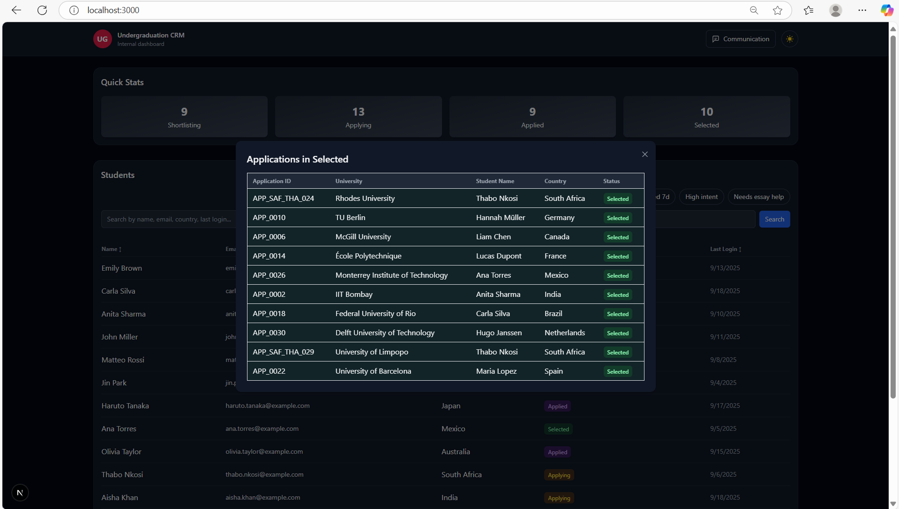
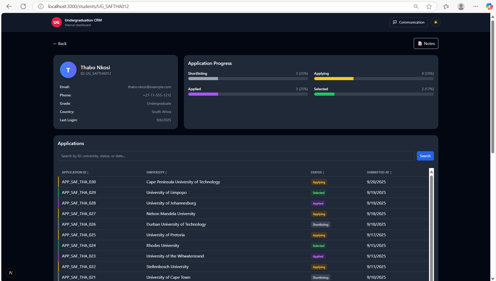
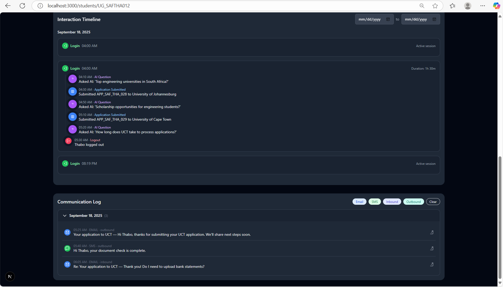
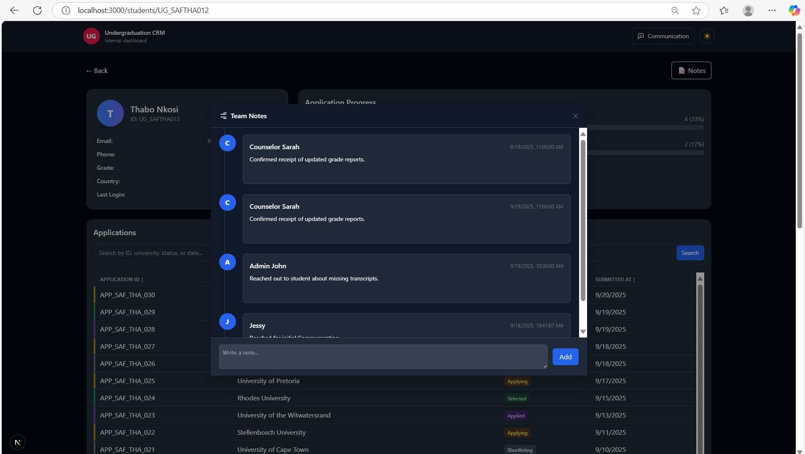
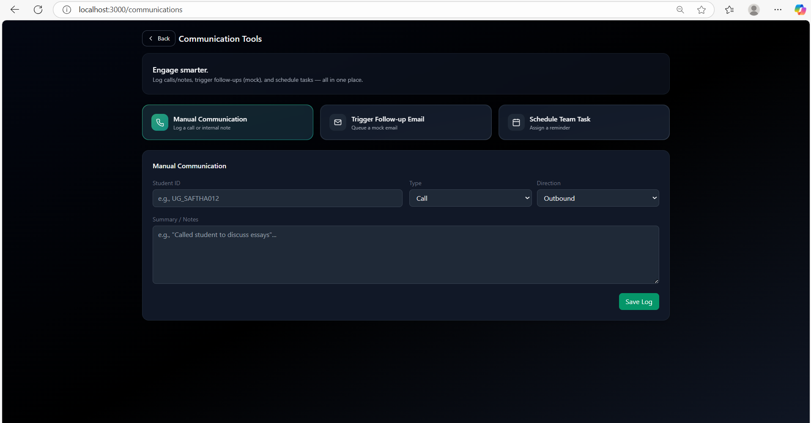

# Undergraduation CRM

A modern, production‑ready **Next.js + Firebase (Firestore)** CRM for managing **undergraduate applications** with a premium, responsive UI (light/dark), modular code, and clean data contracts. It is designed so a new developer can clone, set env, run, and understand every part **end‑to‑end** in under an hour.
 
---

## Table of Contents

1. [What This is (Story Walkthrough)](#what-this-is-story-walkthrough)  
2. [Feature Highlights](#feature-highlights)  
3. [Architecture Overview](#architecture-overview)  
4. [Project Structure](#project-structure)  
5. [Local Setup & Running](#local-setup--running)  
6. [.env & Configuration](#env--configuration)  
7. [Tailwind & Theming](#tailwind--theming)  
8. [Data Model (Firestore Collections)](#data-model-firestore-collections)  
9. [API Reference (Next.js API Routes)](#api-reference-nextjs-api-routes)  
10. [Component Reference (UI & Props)](#component-reference-ui--props)  
11. [Student Detail UX (Applications, Timeline, Comms, Notes)](#student-detail-ux-applications-timeline-comms-notes)  
12. [Insights & Filters](#insights--filters)  
13. [Seeding & Testing with Postman / cURL](#seeding--testing-with-postman--curl)  
14. [Firestore Rules (Dev) & Indexes](#firestore-rules-dev--indexes)  
15. [Error Handling & Logging](#error-handling--logging)  
16. [Accessibility & UX Notes](#accessibility--ux-notes)  
17. [Performance Tips](#performance-tips)  
18. [Security Notes](#security-notes)  
19. [Common Troubleshooting](#common-troubleshooting)  
20. [Roadmap](#roadmap)  
21. [Contributing & Code Quality](#contributing--code-quality)  
22. [License](#license)

---

## What This Is (Story Walkthrough)

**You open the dashboard** (`/`). At the top, **Quick Stats** shows pipeline stage counts: _Shortlisting → Applying → Applied → Selected_. Click any card to open a modal listing the applications in that stage with student context.

Below, the **Students** table shows the unified student directory with:  
- **Multi-term search** (press Enter to add a chip: name/email/country/last‑login).  
- **Quick filter pills** aligned **above the search bar on the right**:  
  - _Not contacted 7d_, _High intent_, _Needs essay help_ (togglable; combine with search).  
- **Sortable columns** (Name, Email, Country, Last Login).  
- **Latest application status** badge per student.
 _Landing Page_
  

_QuickStat-Applications_
  

Click a row to open the **Student Detail** page:  
- **Info card** + **progress bars** (same 4 stages; clickable to filter the Applications table).  
- **Applications table** (styled, sortable, hover accent).  
- **Interaction Timeline**: sessions (Login → nested activities such as AI questions & application submissions) with date filtering.  
- **Communication Log**: grouped by day; collapsible; clicking an item opens a content popover (email/SMS/call/note).  
- **Internal Notes**: wide modal with add/edit/delete; shows author, timestamp, content.
_StudentInfo&ApplicationInfo_
  
_Interaction&CommunicationLog_
  
_InternalNotes_
  

From the header, click **Communication** to open a **3‑mode console** (glass UI):  
1) **Manual Communication** (log a call or internal note),  
2) **Trigger Follow‑up Email (Mock)** with templates,  
3) **Schedule Team Task** (due date/time, assignee).  
Toasts confirm actions.
_CommunicationTools_
  

Everything is **SVG iconography**, **TailwindCSS**, responsive, and dark‑mode ready.

---

## Feature Highlights

- **Light/Dark** theme toggle (SVG sun/moon).  
- **Quick Stats** with modal drill‑down.  
- **Students Table**  
  - Multi‑term search; Enter to add chips.  
  - Quick filter pills (_not contacted 7d_, _high intent_, _needs essay help_).  
  - Sorting & row hover accent.  
- **Student Detail**  
  - Info card; clickable stage progress.  
  - Applications table (status badges).  
  - Interaction Timeline (nested under login; date range).  
  - Communication Log (day groups; collapsible; popovers).  
  - Internal Notes (modal CRUD).  
- **Communication Tools** page with three modes and toasts.  
- **Optional** materialized metrics (`student_metrics`) for scalable insights.  
- Modular `lib/db.ts` helpers + typed components.

---

## Architecture Overview

- **Next.js (Pages Router)** for pages and API routes.  
- **Firestore** as the data store (client SDK).  
- **TailwindCSS** for styling; small `.card` utility for consistent cards.  
- **API routes** proxy simple CRUD to Firestore (for Postman testing & decoupling UI).  
- **Components** are dumb/presentational where possible, with clear props.  
- **Optional metrics**: _student_metrics_ acts as a materialized view for fast filtering and dashboards.

---

## Project Structure

```
undergraduation-crm/
├─ pages/
│  ├─ index.tsx                 # Dashboard: QuickStats + Students table
│  ├─ students/
│  │  └─ [id].tsx               # Student detail page (profile, progress bars, apps, timelines)
│  ├─ communications/
│  │  └─ index.tsx              # Communication Tools console (3-mode UI)
│  └─ api/
│     ├─ students/
│     │  ├─ index.ts            # GET list, POST add/bulk students
|     ├─ studentInteractions
│     │  ├─ [id].ts             # PUT update, DELETE remove a student
│     ├─ applications/
│     │  └─ [id].ts             # GET/POST applications by studentId
│     ├─ interactions/
│     │  └─ [id].ts             # GET/POST interactions by studentId
│     ├─ communications/
│     │  └─ [id].ts             # GET/POST email/sms/call/note by studentId
│     ├─ notes/
│     │  └─ [id].ts             # GET/POST/PUT/DELETE notes by studentId
│     ├─ tasks/
│     │  └─ index.ts            # GET/POST tasks (reminders)
│     └─ metrics/
│        └─ rebuild.ts          # (Optional) POST rebuild materialized student metrics
│
├─ components/
│  ├─ Header.tsx                # Brand + Communication link + Theme toggle (SVG Sun/Moon)
│  ├─ Layout.tsx                # Page shell (header + container + theme classes)
│  ├─ QuickStats.tsx            # Stage KPIs + modal (click to view apps in that stage)
│  ├─ QuickStatsModal.tsx       # Reusable modal for stage details
│  ├─ StudentTable.tsx          # Multi-filter search, quick filter pills, sorting
│  ├─ InteractionTimeline.tsx   # Indented sessions (login→activities), date range picker
│  ├─ CommunicationLog.tsx      # Day-grouped, collapsible, content popovers
│  ├─ NotesModal.tsx            # Wide, card-ified notes with avatars & actions
│
├─ lib/
│  ├─ firebase.ts               # Firebase app + Firestore init (region nam5)
│  ├─ db.ts                     # Thin data helpers (getStudents, getApplications, etc.)
│  └─ metrics.ts                # (Optional) Build/refresh student_metrics materialized view
│
├─ styles/
│  └─ globals.css               # Tailwind base + .card and other small utilities
│
├─ public/                      # Static assets (if any)
├─ .env.local                   # Firebase credentials (not committed)
├─ tailwind.config.js           # Tailwind setup + content globs
├─ postcss.config.js
├─ tsconfig.json
└─ README.md                    # This file
```
---

## Local Setup & Running

1) **Prereqs**
- Node.js ≥ 18.x (LTS)  
- A Firebase project with **Firestore** enabled (we used region `nam5`).

2) **Install**
```bash
npm install
```

3) **Create env**
Create `.env.local` at project root:
```bash
NEXT_PUBLIC_FIREBASE_API_KEY=YOUR_API_KEY
NEXT_PUBLIC_FIREBASE_AUTH_DOMAIN=your-app.firebaseapp.com
NEXT_PUBLIC_FIREBASE_PROJECT_ID=ug-crm
NEXT_PUBLIC_FIREBASE_STORAGE_BUCKET=your-app.appspot.com
NEXT_PUBLIC_FIREBASE_MESSAGING_SENDER_ID=YOUR_SENDER_ID
NEXT_PUBLIC_FIREBASE_APP_ID=YOUR_APP_ID
```

4) **Run**
```bash
npm run dev
# visit http://localhost:3000
```

5) **(Optional) Seed data** using Postman/cURL (see [Seeding](#seeding--testing-with-postman--curl)).

---

## .env & Configuration

- We use the **client Firestore SDK**. These keys are public configuration (still keep `.env.local` out of git).
- Ensure the **Project ID** is correct (`NEXT_PUBLIC_FIREBASE_PROJECT_ID`).  
- If using emulators, set `FIRESTORE_EMULATOR_HOST=localhost:8080` in `.env.local` and wire in `lib/firebase.ts` accordingly.

---

## Tailwind & Theming

**`styles/globals.css`**
```css
@tailwind base;
@tailwind components;
@tailwind utilities;

/* shared card utility */
.card { @apply rounded-2xl border border-gray-200 dark:border-gray-800 bg-white dark:bg-gray-900 shadow-sm p-4; }
```

**`tailwind.config.js`**
```js
module.exports = {
  content: ["./pages/**/*.{ts,tsx}", "./components/**/*.{ts,tsx}"],
  theme: { extend: {} },
  plugins: [],
}
```

**Theme toggle** lives in `components/ThemeToggle.tsx` (SVG sun/moon). The `Layout` component adds `class="dark"` at the HTML root based on preference.

---

## Data Model (Firestore Collections)

### `students` (docId = studentId, e.g. `UG_SAFTHA012`)
```ts
{
  name: string,
  email: string,
  country: string,
  phone?: string,
  grade?: string,
  lastLogin?: Timestamp | ISO string
}
```

### `applications`
```ts
{
  id?: string,                 // optional human id like APP_SAF_THA_028
  studentId: string,           // ref to students/<id>
  university: string,
  status: "Shortlisting" | "Applying" | "Applied" | "Selected",
  time: Timestamp
}
```

### `interactions`
```ts
{
  studentId: string,
  type: "login" | "logout" | "question_asked" | "application_submitted",
  details: string,
  timestamp: Timestamp
}
```

### `communications`
```ts
{
  studentId: string,
  type: "email" | "sms" | "call" | "note",
  direction?: "inbound" | "outbound" | null,
  from?: string | null,
  to?: string | null,
  subject?: string | null,
  content: string,
  status?: "mocked" | "sent" | "failed" | null,
  timestamp: Timestamp
}
```

### `notes`
```ts
{
  studentId: string,
  author: string,
  content: string,
  timestamp: Timestamp
}
```

### `tasks`
```ts
{
  title: string,
  dueAt: Timestamp,
  assignee?: string | null,
  studentId?: string | null,
  notes?: string | null,
  status: "open" | "done",
  createdAt: Timestamp
}
```

### (Optional) `student_metrics` (materialized view)
```ts
{
  studentId: string,
  lastContactAt: Timestamp,
  intentScore: number,         // weighted engagement score
  needsEssayHelp: boolean,
  latestApplicationStatus: string | null,
  lastLogin: Timestamp | null,
  updatedAt: Timestamp
}
```

---

## API Reference (Next.js API Routes)

Base URL (dev): `http://localhost:3000/api`

> All endpoints respond with JSON. On errors: `{ error: "message" }` and proper HTTP status.

### Students
- `GET /students` → list students
- `POST /students` → add **one** or **bulk** (array)
- `GET /students/:id` → get one (if implemented)
- `PUT /students/:id` → update partial
- `DELETE /students/:id` → remove

**Examples**
```bash
# Add one
curl -X POST http://localhost:3000/api/students \
  -H "Content-Type: application/json" \
  -d '{ "id":"UG_SAFTHA012","name":"Thabo Nkosi","email":"thabo@example.com","country":"South Africa","lastLogin":"2025-09-18T14:10:00Z" }'

# Bulk add
curl -X POST http://localhost:3000/api/students \
  -H "Content-Type: application/json" \
  -d '[{ "id":"UG_UKOLI001", "name":"Olivia Taylor","email":"olivia@example.com","country":"UK" }]'
```

### Applications (by student)
- `GET /applications/:studentId`
- `POST /applications/:studentId` (one or bulk)

```bash
curl -X POST http://localhost:3000/api/applications/UG_SAFTHA012 \
  -H "Content-Type: application/json" \
  -d '[{ "id":"APP_SAF_THA_028","university":"UJ","status":"Applied","time":"2025-09-18T09:30:00Z" }]'
```

### Interactions (by student)
- `GET /interactions/:studentId`
- `POST /interactions/:studentId` (one or bulk)

### Communications (by student)
- `GET /communications/:studentId`
- `POST /communications/:studentId`
  - Manual call/note or mock email

### Notes (by student)
- `GET /notes/:studentId`
- `POST /notes/:studentId` (one or bulk)  
- `PUT /notes/:studentId` → `{ noteId, content }`  
- `DELETE /notes/:studentId` → `{ noteId }`

### Tasks
- `GET /tasks`
- `POST /tasks`

### Metrics (optional)
- `POST /metrics/rebuild` → rebuild `student_metrics` for all students.

---

## Component Reference (UI & Props)

### `Layout.tsx`
- Wraps pages with header, container, theme classes.
- Slots: `children`.

### `Header.tsx`
- Branding + **Communication** link + **ThemeToggle**.
- Place **Communication** button before the toggle as requested.
- SVG sun/moon.  
- Remembers preference (via `localStorage` or `prefers-color-scheme`).

### `QuickStats.tsx`
- Shows 4 stage cards: **Shortlisting / Applying / Applied / Selected**.  
- Click → `QuickStatsModal` lists applications in that stage (joined with student name/country).

### `QuickStatsModal.tsx`
- Props: `open`, `onClose`, `title`, `applications` (array with `{studentName, country, status, time, university}`).
- Renders a responsive modal; table style matches dashboard.

### `StudentTable.tsx`
- Fetches students + latest app status (via `getLatestApplicationByStudent`).  
- **Search**: type and press Enter to add a chip (supports `>YYYY-MM-DD` or `<YYYY-MM-DD` for lastLogin).  
- **Quick Filter Pills** (top‑right): `not-contacted-7d`, `high-intent`, `needs-essay-help`.  
  - Currently heuristic‑based in component (can be swapped to metrics).  
- **Sort** by Name/Email/Country/Last Login.  
- Row click → navigate to `/students/[id]`.

### StudentProgress
- Renders 4 bars (gray/amber/purple/green).  
- Click a bar → filter the applications table below (by status).

### `ApplicationsTable.tsx`
- Columns: Application ID, University, Status (badge), Time.  
- Hover accent bar + smooth transitions for modern feel.  
- Optional client‑side sorting, search in detail view.

### `InteractionTimeline.tsx`
- Groups by **login session** (indent nested activities such as `question_asked` and `application_submitted`) until `logout`.  
- Date range picker at the top (from → to).  
- Latest date shown by default; older via picker.  
- Icons do not overlap content; consistent spacing.

### `CommunicationLog.tsx`
- Day‑grouped, collapsible panels.  
- Each item shows type (email/sms/call/note), time, short summary.  
- Clicking shows popover with content (subject/body for email).

### `NotesModal.tsx`
- Trigger button placed in the student header (right side).  
- Wide modal with list of notes (author, timestamp, content).  
- Actions: add, edit, delete.  
- Padded layout (wider than the first version per feedback).

### `communications/index.tsx`
- **Hero** + **3 gradient cards (modes)** + **panel** below that switches by mode.  
- **Manual Communication** form → POST to `/api/communications/[studentId]`.  
- **Mock Email** form → templates + POST to the same endpoint (with type=email, status=mocked).  
- **Tasks** form → POST `/api/tasks`.

---

## Student Detail UX (Applications, Timeline, Comms, Notes)

- **Top row layout**: Info card (1/4 width) + Progress bars (2/4 width).  
- **Below**: Applications table (full width).  
- **Timeline & Communication** have spacing separation; icons never overlap content.  
- **Notes** icon in header → opens modal.  

All pieces are modular and can be toggled per product requirements.

---

## Insights & Filters

- We keep **QuickStats** as stage‑only stats.  
- **Quick filter pills** live **above the Students table search** (right‑aligned).  
- Current heuristics (in `StudentTable.tsx`):  
  - _Not contacted 7d_: lastLogin is older than 7 days or missing.  
  - _High intent_: latestStatus in `Applying` or `Applied`.  
  - _Needs essay help_: a placeholder that looks for “essay” in `grade` (replace with metrics or tags).

**Optional scaling**: adopt `student_metrics` to compute `lastContactAt`, `intentScore`, and `needsEssayHelp` from `communications`/`interactions` content and update on write. The UI remains unchanged; only data source flips.

---

## Seeding & Testing with Postman / cURL

1) **Students**
```bash
curl -X POST http://localhost:3000/api/students \
  -H "Content-Type: application/json" \
  -d '[
    { "id":"UG_SAFTHA012","name":"Thabo Nkosi","email":"thabo@example.com","country":"South Africa","lastLogin":"2025-09-18T14:10:00Z" },
    { "id":"UG_UKOLI001","name":"Olivia Taylor","email":"olivia@example.com","country":"United Kingdom","lastLogin":"2025-09-17T09:35:00Z" }
  ]'
```

2) **Applications**
```bash
curl -X POST http://localhost:3000/api/applications/UG_SAFTHA012 \
  -H "Content-Type: application/json" \
  -d '[
    { "id":"APP_SAF_THA_028","university":"University of Johannesburg","status":"Applied","time":"2025-09-18T09:30:00Z" },
    { "id":"APP_SAF_THA_029","university":"University of Cape Town","status":"Applying","time":"2025-09-18T09:50:00Z" }
  ]'
```

3) **Interactions**
```bash
curl -X POST http://localhost:3000/api/interactions/UG_SAFTHA012 \
  -H "Content-Type: application/json" \
  -d '[
    { "type":"login","details":"Thabo logged in from web portal","timestamp":"2025-09-18T09:20:00Z" },
    { "type":"question_asked","details":"Asked AI: Scholarship opportunities for engineering students?","timestamp":"2025-09-18T09:50:00Z" },
    { "type":"application_submitted","details":"Submitted APP_SAF_THA_028 to UJ","timestamp":"2025-09-18T10:30:00Z" },
    { "type":"logout","details":"Thabo logged out","timestamp":"2025-09-18T10:45:00Z" }
  ]'
```

4) **Communications**
```bash
curl -X POST http://localhost:3000/api/communications/UG_SAFTHA012 \
  -H "Content-Type: application/json" \
  -d '[
    { "type":"call","direction":"outbound","content":"Called to discuss essays","timestamp":"2025-09-18T11:00:00Z" },
    { "type":"email","direction":"outbound","to":"thabo@example.com","from":"noreply@ug-crm.dev","subject":"Next steps","content":"Hi Thabo...","status":"mocked","timestamp":"2025-09-18T11:10:00Z" }
  ]'
```

5) **Notes**
```bash
curl -X POST http://localhost:3000/api/notes/UG_SAFTHA012 \
  -H "Content-Type: application/json" \
  -d '{ "author":"Admin John","content":"Reached out about missing transcripts","timestamp":"2025-09-19T14:30:00Z" }'
```

6) **Tasks**
```bash
curl -X POST http://localhost:3000/api/tasks \
  -H "Content-Type: application/json" \
  -d '{ "title":"Follow up with Olivia","dueAt":"2025-09-22T10:00:00Z","assignee":"Sarah","studentId":"UG_UKOLI001","notes":"Check essays" }'
```

---

## Firestore Rules (Dev) & Indexes

**Development rules** (very open; do NOT use in prod):
```js
rules_version = '2';
service cloud.firestore {
  match /databases/{database}/documents {
    match /{document=**} {
      allow read, write: if request.time < timestamp.date(2099, 1, 1);
    }
  }
}
```

**Indexes** (you’ll be prompted with links by Firebase if missing):  
- `applications`: composite → `studentId (asc), time (desc)`  
- `interactions`: composite → `studentId (asc), timestamp (desc)`  
- `communications`: composite → `studentId (asc), timestamp (desc)`  
- `notes`: composite → `studentId (asc), timestamp (desc)`  
- Optional single-field for `student_metrics`: `lastContactAt`, `intentScore`, `needsEssayHelp`, `lastLogin`.

---

## Error Handling & Logging

- API routes return `4xx` for bad input and `5xx` for server errors with `{ error }`.  
- Client components show inline states (toasts, empty states, “No students found”).  
- Console errors include Firestore messages (e.g., _requires index_ → clickable console link).

---

## Accessibility & UX Notes

- Buttons and interactive chips have :hover and :focus styles; tab sequence is logical.  
- Color choices: status badges use non‑aggressive palettes (gray/amber/purple/green).  
- Timeline & tables have adequate spacing and readable contrast in light/dark modes.  
- Icon buttons include `title` attribute for screen reader hints where appropriate.

---

## Performance Tips

- List rendering uses `key={id}` and memoized filters/sorts (`useMemo`).  
- Data helpers fetch minimal sets; you can paginate if the dataset grows.  
- Consider moving high‑frequency metrics to `student_metrics` to avoid N+1 queries.  
- Static assets served from `/public` where possible.

---

## Security Notes

- Dev rules are open; replace with auth‑based rules in production (roles: admin/counselor).  
- Do not store secrets in the repo; `.env.local` is git‑ignored.  
- Validate all API inputs on the server before writing to Firestore.  
- For real emailing/SMS, use secured server integrations (SendGrid/Twilio) with server‑side keys only.

---

## Common Troubleshooting

- **App Router & Pages Router conflict**: remove `/app` directory; we use **Pages Router**.  
- **Unknown Tailwind class**: ensure `tailwind.config.js` `content` matches `./pages` & `./components` and `globals.css` includes `@tailwind` directives.  
- **Firestore `PERMISSION_DENIED`**: use dev rules above or auth; confirm project ID in `.env.local`.  
- **“Query requires an index”**: click the console link; wait for build.  
- **Invalid hook call**: only call hooks inside React function components (not module scope).  
- **Invalid Date**: ensure timestamps are Firestore `Timestamp` or ISO strings; `formatDate()` covers both.  
- **ECONNREFUSED on /api**: run `npm run dev` and hit `http://localhost:3000`.

---

## Roadmap

- Promote heuristics to **student_metrics** + Cloud Functions triggers.  
- Role‑based access (RBAC) and protected routes.  
- Real email/SMS integrations; templates service.  
- File uploads & document checklist UX.  
- CSV import/export; audit logs; admin dashboard.

---

## Contributing & Code Quality

- **TypeScript** everywhere; keep components focused.  
- Small, composable functions; prefer pure helpers in `lib/`.  
- Ensure APIs are idempotent and validate body shapes.  
- Consider `eslint` + `prettier` + Husky pre‑commit hooks.

**Scripts**
```bash
npm run dev        # start dev server
npm run build      # build
npm start          # serve production build
# npm run lint     # if configured
```

---

## License

Internal demo project for educational/assessment purposes. Add a proper license if you plan to distribute.

---

**That’s it!** This README is the single source of truth for the project’s purpose, structure, setup, endpoints, components, and UX decisions. Happy shipping 🚀
